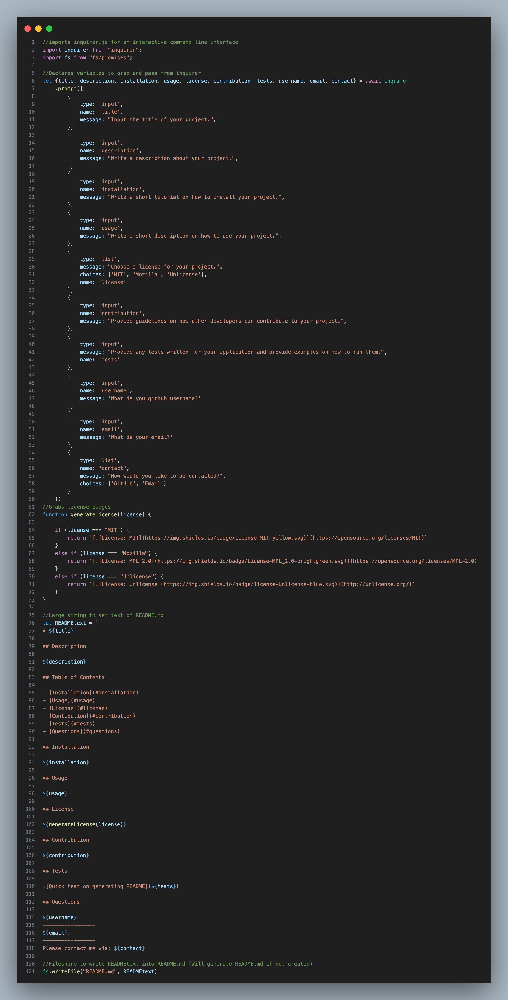

# README-Gen

## Description

Quick generator that grabs user input and creates a README.md for them!

## Table of Contents

- [Installation](#installation)
- [Usage](#usage)
- [License](#license)
- [Contibution](#contribution)
- [Tests](#tests)
- [Questions](#questions)

## Installation

To install the project, clone down the code and run "node index.mjs"

## Usage

Simply follow the prompts and input required data to create a README

## License

## Contribution

N/A

## Tests

## Questions

https://www.github.com/dylanstoudt
-----------------
dylanstoudt@aol.com
-----------------
Please contact me via: Email
